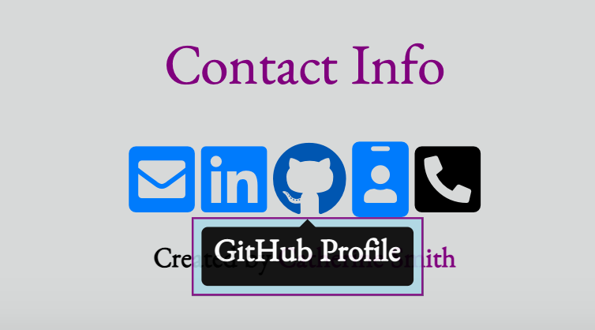

# Updated Portfolio

As I progress through the program and create more applications (projects and homework assignments), I will be updating my portfolio to build toward becoming employer-competitive. This is an update following the completion of project 2.
*Note: I realize the block vs. inline spacing is a bit wonky at the moment. I'll end up making it different once updating with React soon.


## My Portfolio Links
1. [Link to Porfolio](https://crsmith01.github.io/updated-portfolio-2/)
2. [Link to Resume](https://docs.google.com/document/d/e/2PACX-1vTOmmrXw5f6mpnJ4ntzogEC_U2VBiDCNWEIMASmboPkLAYC9ApUQoJoF1oIFBqTWVA4OQbMzuODDxsM/pub)
3. [Link to GitHub profile](https://github.com/crsmith01)
4. [Link to LinkedIn profile](https://www.linkedin.com/in/catherine-smith24601)


## User Story

```
AS A potential employee,
I WANT to update my deployed portfolio of work samples for potential employers to view
SO THAT THEY can review samples of my work and assess whether I am a good candidate for an open position.
```

## Acceptance Criteria

These are the critical requirements necessary to develop a portfolio that satisfies a typical hiring manager’s needs:

```
GIVEN they need to sample a potential employee's previous work
1. WHEN they load my portfolio,
    THEN they are presented with my name, a recent photo, and links to sections about me, my work, my resume, and how to contact me.
2. WHEN they click one of the links in the navigation,
    THEN the UI scrolls to the corresponding section.
3. WHEN they click on the link to the section about my work,
    THEN the UI scrolls to a section with titled images of my applications.
4. WHEN they click on the images of the applications,
    THEN they are taken to that deployed application.
5. WHEN they resize the page or view the site on various screens and devices
    THEN they are presented with a responsive layout that adapts to their viewport.
6. WHEN they click a link or button,
    THEN they are taken to the appropriate destination (i.e. GitHub profile, LinkedIn profile, deployed application, GitHub repository)
```

## Screenshots of finished product:





## Link to deployed application: 
The deployed application can be found via this 
[link](https://crsmith01.github.io/updated-portfolio-2/).


### Brought to you by:
* [Catherine Smith](https://github.com/crsmith01)
